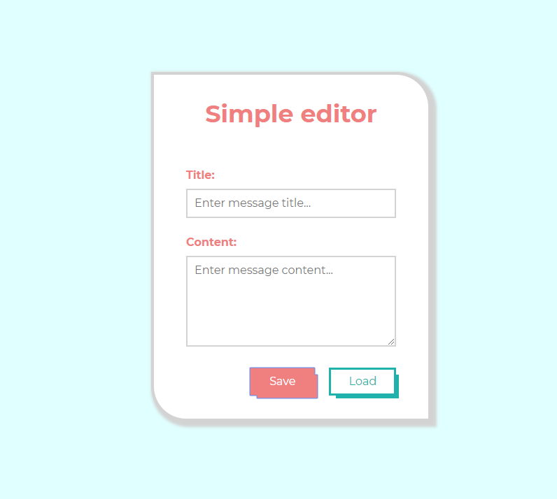

# My simple editor to keep notes in localStorage

Come on, see live: [Live here](https://sasinskil.github.io/simple-editor)

## What to do to run the site locally ?

`npm install -g gulp-cli`

`npm install`

`gulp`

To ***publish*** with the help of github pages use `npm run deploy`

### Technologies used

- HTML/HTML5,
- SASS,
- JavaScript,
- Gulp,
- Figma -> [With extension](https://pdkit.co)
